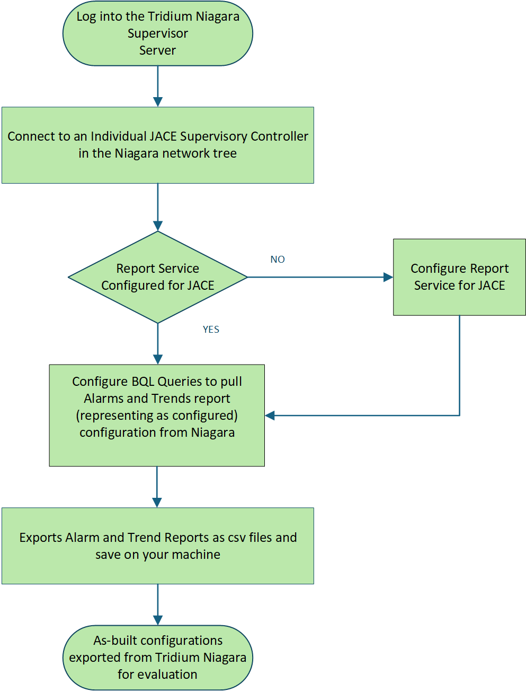
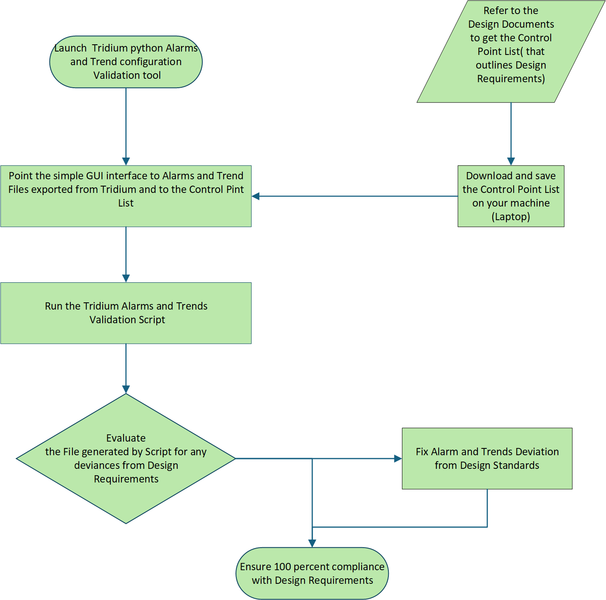

# Niagara Alarm & Trend Validation Tool

This tool validates **Tridium Niagara (Siemens / Schneider)** alarm and trend configurations against the project **Control Point List (CPL)**.  
It uses a lightweight **PySimpleGUI** interface and a clearly defined **pipeline architecture**.

## Introduction

In Niagara N4, alarms are configured directly on control points using **Alarm Palettes** and various **Alarm Extensions**.  
Common alarm types include:

- **Boolean Alarm Extension** – triggers when a boolean point evaluates to a specific state.  
- **Numeric Alarm Extension** – evaluates thresholds on numeric values.  
- **OutOfRange / Limit Alarms** – high/low conditions tied to analog values.  
- **Fault / Status Alarms** – based on device health or communication status.  

# System Architecture

Below is a high-level architecture diagram illustrating the full pipeline from Niagara exports to final validation output:

```mermaid
flowchart TD
    A[CPL (Design Requirements)] -->|Imported as Excel| E[Validation Engine]
    B[Niagara JACE/Supervisor] -->|Export Alarm & Trend CSVs| C[As-Built Niagara Data]
    C --> E
    E --> F[Rule Evaluation<br>(Alarm Class, Delay, Trends)]
    F --> G[Excel Report Generation]
    G --> H[Final Compliance Output]
```

### Pipeline Stages

1. **Data Extraction**
   - Export Alarm and Trend CSVs from Niagara JACE/Supervisor using Report Service & BQL.
   - Export the CPL (Excel) from project documentation.

2. **Normalization**
   - Standardize naming, clean characters, and normalize alarm/trend attributes.

3. **Point Naming & Matching**
   - Niagara alarm/trend configurations usually contain prefixes and tokens similar to those in the design CPL.
   - The tool tokenizes names and matches Niagara points to CPL entries.

4. **Rule Evaluation**
   - Compare Alarm Class, Notification Level, Delay, and Trend settings.
   - Identify mismatches, missing points, and compliant entries.

5. **Report Generation**
   - Produce Excel reports with highlighting for mismatches, matches, and items needing review.

---

# Architecture Diagrams

### Niagara Configuration Export Flow


### Validation Workflow


---

# PySimpleGUI Interface

The GUI provides:

- File inputs for:  
  - Alarm File 1 (Boolean alarms)  
  - Alarm File 2 (Numeric alarms)  
  - Trend File  
  - CPL (Control Point List)  
- Buttons for vendor-specific validation:  
  - **Point Validation (Siemens)**  
  - **Point Validation (Schneider)**  
- Preview buttons for in-GUI data inspection  
- Progress bar for long validation tasks  

---

# Usage

1. Launch the GUI.
2. Select Alarm/Trend CSVs and CPL file.
3. Choose Siemens or Schneider validation.
4. Select output folder.
5. Run validation.
6. Excel reports are generated automatically.

---

# Output Summary

The generated Excel report highlights:
- **Red** → Configuration does NOT match CPL  
- **Green** → Fully compliant  
- **Yellow** → Partially validated (manual review needed)  

This tool provides a repeatable, engineering-focused method to validate Niagara alarm and trend configurations against the CPL.

