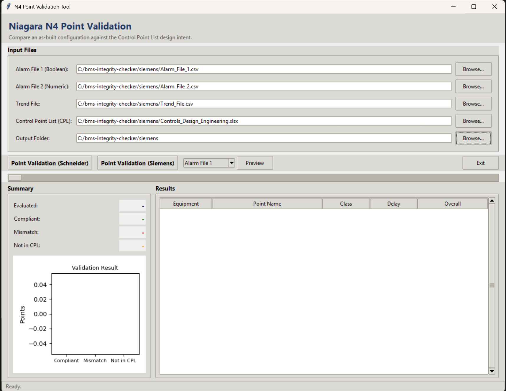
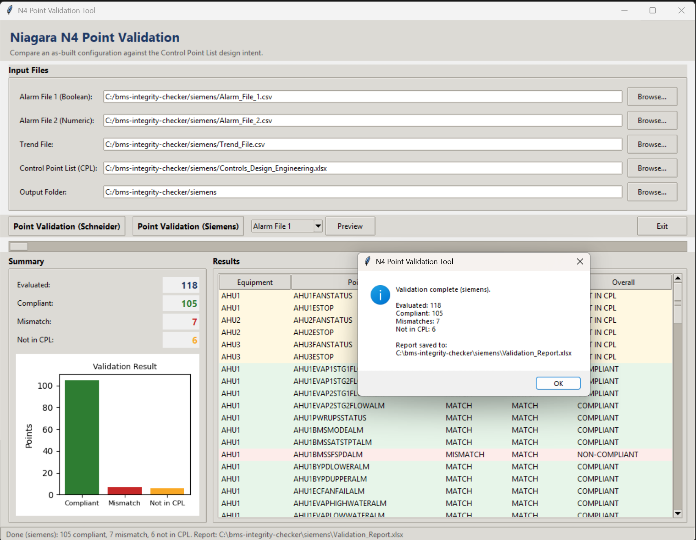
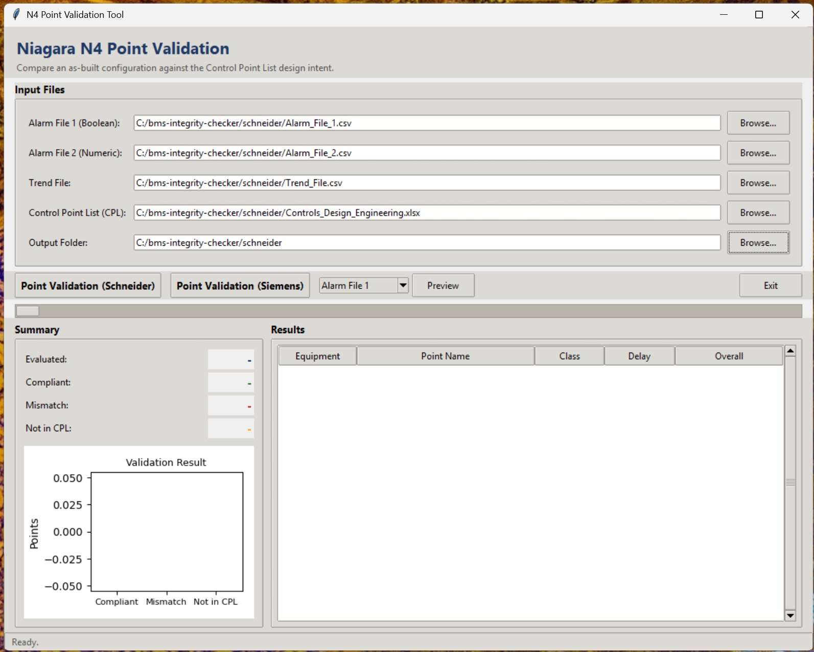
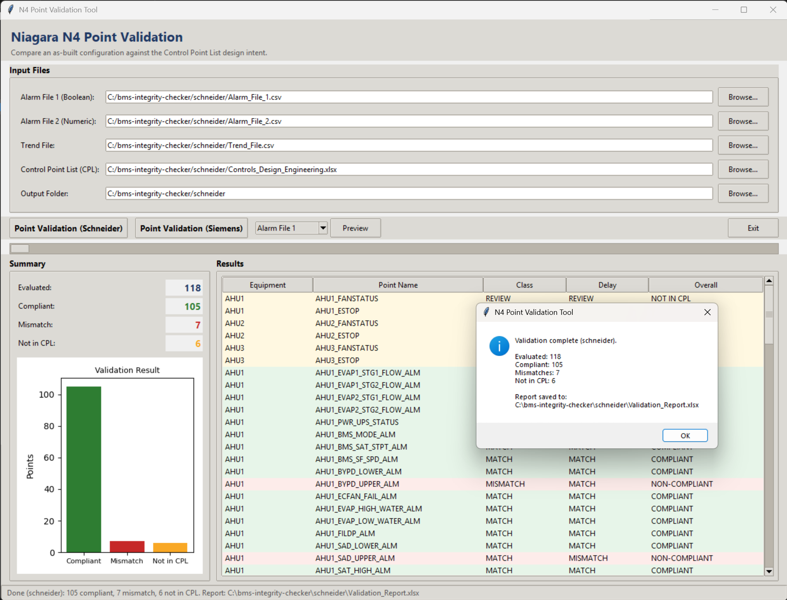

# Niagara Alarm & Trend Validation Tool

The Niagara Alarm & Trend Validation Tool automatically checks that the **alarm and trend configuration** built in **Tridium Niagara (Siemens / Schneider)** matches the project's **Control Point List (CPL)**.

Instead of manually comparing exported Niagara configurations against design documentation point-by-point, this tool loads both sources, matches the points, applies validation rules, and produces a colour-coded Excel report showing exactly where the as-built system agrees with — or deviates from — the design intent.

It runs as a lightweight **Tkinter** desktop application built around a simple, deterministic **pipeline architecture**.

## Introduction

In Niagara N4, alarms are configured directly on control points using **Alarm Palettes** and various **Alarm Extensions**. The tool understands the most common alarm types:

- **Boolean Alarm Extension** – triggers when a boolean point evaluates to a specific state.
- **Numeric Alarm Extension** – evaluates thresholds on numeric values.
- **OutOfRange / Limit Alarms** – high/low conditions tied to analog values.
- **Fault / Status Alarms** – based on device health or communication status.

Because these settings are entered by hand during commissioning, they can drift from the approved design. This tool provides a **repeatable, engineering-focused** way to catch those differences before handover.

For **existing sites**, the tool also lets you compare the current as-built configuration against the latest iteration of the design standard (CPL), identifying gaps and allowing the configurations to be updated so as to align with the current standard.

> **Note:** This validation depends on the **Control Point List following a standard template**, so that the tool can reliably parse the exported output and perform the comparison. If the CPL does not conform to the expected template structure, the parsing and validation steps will not produce accurate results.

# System Architecture

The tool operates as a simple, deterministic pipeline. It takes two inputs:

- **As-built alarm & trend configuration** exported from Niagara (CSV)
- **Design intent** defined in the Control Point List (CPL, Excel)

and produces a single **validated configuration report** (Excel).

The block diagram below shows the main layers and how data flows through them:

```
+-----------------------------+         +-----------------------------+
|  Control Point List (CPL)   |         |    Niagara JACE/Supervisor  |
|  - Design requirements      |         |    - Alarm configuration    |
|  - Point names & metadata   |         |    - Trend configuration    |
|  (Excel)                    |         |    (CSV via BQL/Reports)    |
+--------------+--------------+         +--------------+--------------+
               \                                      /
                \                                    /
                 \                                  /
                  v                                v
              +------------------------------------------+
              |           Data Extraction Layer          |
              |  - Read CPL (Excel)                      |
              |  - Read Alarm/Trend CSVs                |
              +----------------------+-------------------+
                                     |
                                     v
              +------------------------------------------+
              |           Normalization Layer            |
              |  - Clean & uppercase point names         |
              |  - Remove symbols / brackets             |
              |  - Normalize delays and formats          |
              +----------------------+-------------------+
                                     |
                                     v
              +------------------------------------------+
              |          Point Matching Engine           |
              |  - Tokenize names (Niagara & CPL)        |
              |  - Match as-built points to CPL entries  |
              |  - Detect missing / extra points         |
              +----------------------+-------------------+
                                     |
                                     v
              +------------------------------------------+
              |            Rule Evaluation Layer         |
              |  - Alarm Class vs Notification Level     |
              |  - Delay vs CPL Delay                    |
              |  - Analog: High/Low Limit + Dead Band    |
              |  - Trend interval (shown for reference)  |
              +----------------------+-------------------+
                                     |
                                     v
              +------------------------------------------+
              |             Reporting Layer              |
              |  - Generate Excel reports                |
              |  - Red = mismatch, Green = match         |
              |  - Yellow = manual review required       |
              +----------------------+-------------------+
                                     |
                                     v
              +------------------------------------------+
              |       Final Compliance Report (Excel)    |
              +------------------------------------------+
```

## Pipeline Stages

1. **Data Extraction** – Load the Alarm and Trend CSVs exported from the Niagara JACE/Supervisor, plus the CPL (Excel) from the project documentation.

2. **Normalization** – Standardize point names, strip unwanted characters and brackets, uppercase text, and normalize alarm/trend attributes such as delays so the two sources can be compared reliably.

3. **Point Naming & Matching** – Tokenize the Niagara and CPL names (which usually share prefixes and tokens) and match each as-built point to its corresponding CPL entry, flagging any that are missing or extra.

4. **Rule Evaluation** – Compare Alarm Class, Notification Level, and Delay for every matched point; for analog points also compare the High Limit, Low Limit, and Dead Band against the CPL. The trend interval is carried through to the report for reference. This identifies mismatches, missing points, and fully compliant entries.

5. **Report Generation** – Write Excel reports with colour highlighting for mismatches, matches, and items that need manual review.

---

# Siemens vs Schneider — Why They Are Separate Validations

Even though both vendors are commissioned in the same Niagara N4 framework, **Siemens and Schneider are treated as two distinct validation runs** — the tool exposes a dedicated **Point Validation (Siemens)** and **Point Validation (Schneider)** button for exactly this reason.

The difference comes down to **point-name formatting**. Each vendor exports its point names using a different naming convention, so the raw strings coming out of Niagara do not look the same even when they represent the same physical point:

| Vendor | Point-name style | Example (as exported) |
| ---------- | ---------------------------------- | ----------------------------- |
| **Siemens**   | Concatenated, **no separators**    | `AHU1EVAP1STG1FLOWALM`         |
| **Schneider** | **Underscore-delimited** tokens    | `AHU1_EVAP1_STG1_FLOW_ALM`     |
| **CPL (design)** | Bracketed tokens               | `[EVAP1][STG1][FLOW][ALM]`     |

Because the two vendors segment their names differently, the normalization and tokenization step has to account for each style before it can be matched back to the bracketed CPL point name. To keep matching deterministic and auditable, the two vendors are run **independently**:

- A **Siemens** run normalizes the concatenated, separator-free names.
- A **Schneider** run normalizes the underscore-delimited names.
- Both are then reduced to the same canonical token set and compared against the CPL.

Running them separately avoids cross-vendor false matches, keeps each vendor’s report self-contained, and makes it obvious which naming convention produced any given deviation. Functionally the validation rules (alarm class, delay, CAT high/low limits and dead-band, trend settings) are identical — only the point-name parsing differs.

---

# Process Flow Diagrams

## Niagara Configuration Export Flow

This process describes how the as-built configuration is pulled out of Niagara. Using the Workbench, the alarm and trend extensions are queried via the Report Service and BQL, then exported into CSV files (Boolean alarms, Numeric alarms, and Trends). These files become the raw input consumed by the validation tool.

```
+-----------------------------+
|     Niagara Workbench       |
|  (JACE / Supervisor)        |
+--------------+--------------+
               |
               v
+-----------------------------+
|      Report Service / BQL   |
|  - Query alarm extensions   |
|  - Query trend extensions   |
+--------------+--------------+
               |
               v
+-----------------------------+
|      Export to CSV          |
|  - Alarm File 1 (Boolean)   |
|  - Alarm File 2 (Numeric)   |
|  - Trend File               |
+--------------+--------------+
               |
               v
+-----------------------------+
|   Files Ready for Tool      |
+-----------------------------+
```

## Validation Workflow

This process describes how the exported data is checked against design intent. The Alarm/Trend CSVs and the Control Point List (CPL) are loaded and normalized, as-built points are matched to their CPL entries, and each match is evaluated against the configured rules (alarm class, notification level, delays, and trend settings). The result is a colour-coded Excel report flagging mismatches, compliant items, and entries needing manual review.

```
+-----------------------------+     +-----------------------------+
|   Alarm / Trend CSVs        |     |   Control Point List (CPL)  |
+--------------+--------------+     +--------------+--------------+
               \                                   /
                \                                 /
                 v                               v
              +------------------------------------+
              |        Load & Normalize Data       |
              +------------------+-----------------+
                                 |
                                 v
              +------------------------------------+
              |      Match Points to CPL Entries   |
              +------------------+-----------------+
                                 |
                                 v
              +------------------------------------+
              |        Evaluate Rules              |
              |  - Alarm Class / Notification      |
              |  - Delay values                    |
              |  - Trend enablement / intervals    |
              +------------------+-----------------+
                                 |
                                 v
              +------------------------------------+
              |     Generate Excel Report          |
              |  Red / Green / Yellow highlights   |
              +------------------------------------+
```

---

# Tkinter Interface

The application provides a simple desktop interface so no command line is required:

- **File inputs** for the data sources:
  - Alarm File 1 (Boolean alarms)
  - Alarm File 2 (Numeric alarms)
  - Trend File
  - CPL (Control Point List)
- **Vendor-specific validation buttons:**
  - Point Validation (Siemens)
  - Point Validation (Schneider)
- **Preview buttons** to inspect the loaded data directly in the GUI before running
- **Progress bar** to track long validation runs

---

# Screenshots

The screenshots below are captured from the two vendor validation runs and are stored alongside each vendor’s sample data.

## Siemens

**Selecting the exported Niagara files (Siemens):**



**Validation report generated (Siemens):** note the concatenated, separator-free point names such as `AHU1FANSTATUS` and `AHU1EVAP2STG2FLOWALM`.



## Schneider

**Selecting the exported Niagara files (Schneider):**



**Validation report generated (Schneider):** note the underscore-delimited point names such as `AHU1_FAN_STATUS` and `AHU1_EVAP1_STG1_FLOW_ALM`.



---

# Why Portfolio-Wide Standardization Is a Prerequisite

This tool is fundamentally a **comparison engine**: it can only tell you whether the as-built configuration matches the design when both sides of the comparison speak the same language. That requirement scales up into a broader principle — **for this solution to work reliably across an entire building portfolio, the underlying databases and point-naming conventions must be standardized.** The reasoning below explains why this is not merely a nice-to-have, but a structural precondition for the tool to deliver value at scale.

## 1. The tool matches on structure, not meaning

The matching engine does not "understand" that `AHU1EVAP1STG1FLOWALM` and `[EVAP1][STG1][FLOW][ALM]` describe the same physical point — it infers that by **tokenizing predictable naming patterns** and reducing them to a canonical token set. This works precisely because each vendor follows a *consistent* convention (Siemens concatenated, Schneider underscore-delimited, CPL bracketed). The moment a site deviates from its convention — ad-hoc abbreviations, inconsistent ordering, free-text descriptions, or one-off spellings — the tokenizer can no longer align the names, and matches silently fail or, worse, produce **false matches**. Standardized naming is what makes deterministic, auditable matching possible.

## 2. Non-standard data multiplies engineering effort per site

If every building in a portfolio uses its own naming scheme and its own database layout, then each site effectively needs its own bespoke parsing and normalization logic. What should be a single, reusable validation pipeline degrades into **N custom integrations for N buildings**. Standardization inverts this: one normalization layer, one set of rules, and one report format can be applied unchanged across the entire estate. The cost of validation then grows *linearly with configuration*, not *combinatorially with naming variety*.

## 3. Portfolio-level insight depends on comparable data

The real strategic value of a tool like this is not validating a single JACE — it is being able to say, across dozens of sites, *"which buildings deviate most from standard, and where?"* That kind of cross-site analytics is only meaningful when the data is **structurally comparable**. If Building A calls a sensor `SAT` and Building B calls it `SUPPLYAIRTEMP` and Building C calls it `T-101`, no aggregate view can be trusted. A standardized point-naming taxonomy and a consistent database schema turn a collection of isolated sites into a **queryable portfolio**.

## 4. Standardization protects against configuration drift over time

Alarm and trend settings are entered by hand during commissioning and are frequently modified during a building's life. Without an enforced standard, each modification is an opportunity for divergence, and over years the estate fragments into incompatible dialects. A shared naming standard and database convention act as a **contract**: they define what "correct" looks like, give this tool a stable target to validate against, and make it possible to detect and correct drift before it accumulates.

## 5. Practical requirements for portfolio readiness

To operate this tool across a portfolio, the following should be standardized up front:

- **Point-naming convention** — a single, documented token grammar (equipment → subsystem → measurement → function) applied identically across all vendors and sites, with the vendor-specific delimiter being the *only* permitted variation.
- **Control Point List (CPL) template** — a fixed column structure and bracketed token format, so the parser can read any project's CPL without per-site adjustment.
- **Database / export schema** — consistent CSV export structure from Niagara (same fields, same headers, same units) so extraction logic never has to be rewritten per building.
- **Alarm class & notification taxonomy** — a shared dictionary of alarm classes, notification levels, and delay conventions, so rule evaluation means the same thing everywhere.

> **In short:** the tool automates the *comparison*, but it cannot automate away the need for a *common language*. Standardized databases and point naming are the foundation that lets a single validation solution scale from one building to an entire portfolio — turning what would be dozens of one-off checks into one repeatable, trustworthy, estate-wide process.

---

# Requirements

## Environment

- **Python 3.8+** (Windows recommended)
- **Microsoft Excel** (or any `.xlsx` viewer) to open the generated report

## Python Packages

The tool depends on the following third-party packages:

| Package        | Purpose                                             |
| -------------- | --------------------------------------------------- |
| `pandas`       | Load and manipulate CSV / Excel data                |
| `openpyxl`     | Read/write `.xlsx` files, apply cell fills, chart   |
| `matplotlib`   | Optional in-GUI results chart                       |

The desktop interface is built with **Tkinter/ttk**, which ships with the Python standard library — no separate GUI package is required.

Standard-library modules (`os`, `re`, `threading`, `tkinter`, `pathlib`) require no installation.

## Installation

Install all dependencies with:

```bash
pip install -r requirements.txt
```

---

# Usage

1. Launch the GUI.
2. Select the Alarm/Trend CSVs and the CPL file.
3. Choose Siemens or Schneider validation to match the project vendor.
4. Select the output folder for the report.
5. Run the validation.
6. The Excel report is generated automatically when processing completes.

---

# Output Summary

The generated Excel report uses colour coding so issues stand out at a glance:

- **Red** → Configuration does **not** match the CPL
- **Green** → Fully compliant
- **Yellow** → Partially validated (manual review needed)

Together these give a fast, repeatable, engineering-focused view of how closely the as-built Niagara alarm and trend configuration follows the approved design.
